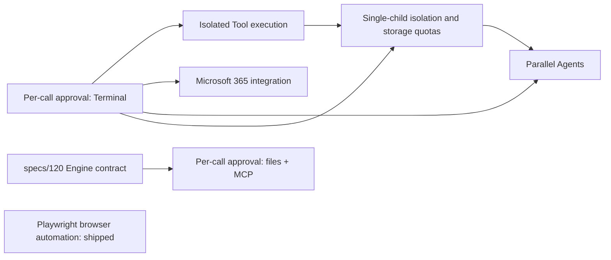

# DeskPilot Prompt File order

This folder contains implementation Prompt Files for candidate DeskPilot
features. Invoke one Prompt File at a time. Complete its tests, review, and
integration before invoking a Prompt File that depends on it.

Completed Prompt Files move to [`archive/`](archive/README.md), which records
what each one shipped as. This folder holds only work that is still open.

The sequence is a recommendation, not a roadmap commitment. Reassess the
remaining order after each feature because implementation findings can change a
later feature's prerequisites or value.

## Remaining order

1. [Implement per-call approval](implement-per-call-approval.prompt.md) — **partly
   shipped.** Terminal commands are gated (decision 0008); file writes outside the
   Project and mutating MCP calls are not. Those two need the Engine contract in
   [`specs/120`](../../specs/120-per-call-approval-engine-contract.md), so this
   Prompt File stays open with its remaining scope only.
2. [Implement isolated Tool execution](implement-isolated-tool-execution.prompt.md)
   contains Terminal actions. It is implemented locally; live acceptance and an
   obtainable enforcing Engine remain release gates.
3. [Implement Microsoft 365 work integration](implement-microsoft-365-integration.prompt.md)
   begins with one read-only, delegated, least-privilege workflow. Keep send,
   share, and mutation operations out of the first slice.
4. [Implement child Agent isolation](implement-child-agent-isolation.prompt.md)
   builds the missing single-child execution boundary and quota-bounded writable
   work areas. It implements this prerequisite after design approval; missing
   child isolation is its task, not a reason to stop at another dependency plan.
5. [Implement parallel Agents](implement-parallel-agents.prompt.md) comes after
   approval, verified child isolation, and its own topology approval. It adds
   concurrent scheduling, aggregate limits, and combined change review.

Playwright browser automation has [shipped](archive/README.md) and is no longer
in this sequence.

## Dependency gates

A Prompt File with an unmet gate may still be invoked for design discovery, but
its own prerequisite section requires implementation to stop before production
code is shipped. The child-isolation Prompt File is the explicit prerequisite
implementation task: do not apply the parallel-Agents absence gate to it. The
Microsoft 365 slice is independent and is not a prerequisite for child isolation.

## Current prerequisite status

Reverify source and test evidence before treating a recorded capability as ready:

- **Isolated Tool execution (decision 0001)** now contains Terminal commands
   through DeskPilot-owned `run_terminal_command` and an enforcing Engine.
   It does not confine native File Tools or bound total read-write Project disk.
- **Playwright (0003)** shipped on 2026-09-05 without 0001's isolation, because
  0003 scopes that prerequisite out on the record: the browser carries its own
  boundary - a separate supervised process with a disposable profile - and needs
  no container runtime. That scoping is browser-only and is not a precedent.
- **Child Agent isolation** must cover every enabled child Tool, separate state
   and credentials, hard storage limits, and cleanup. It is not yet implemented.
- **Parallel Agents (0005)** remains blocked on this complete child boundary,
   verified Engine contracts, and approval of its proposed topology. Passing the
   single-child proof alone does not ship parallel delegation or its merge flow.

## Optional timing changes

Move the read-only Microsoft 365 slice earlier when it has higher product value
than isolation. Do not include outbound mutations until the identity and
data-flow contract has been approved.

## Selection source

See the [feature selection record](../../specs/100-feature-selection.md) for the
rationale behind this order, DeskPilot's current baseline, and the decision
gates each candidate must clear.

## Prompt authoring checks

The [child-isolation checks](evals/child-agent-isolation.md) retain the initial
conversation-based acceptance cases. Static prompt checks are not evidence that
the child runtime works or that the workflow succeeds reliably in a new chat.
