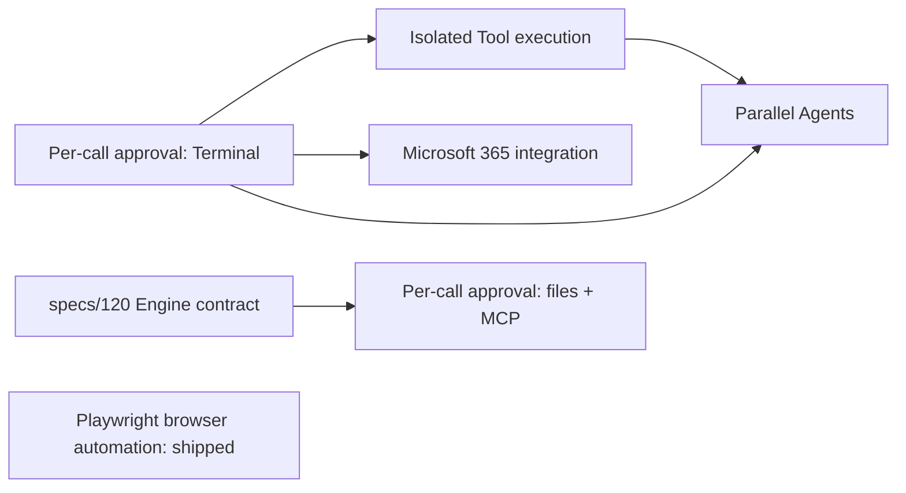

# DeskPilot Prompt File order

This folder contains implementation Prompt Files for candidate DeskPilot
features. Invoke one Prompt File at a time. Complete its tests, review, and
integration before invoking a Prompt File that depends on it.

Completed Prompt Files move to [`archive/`](archive/README.md), which records
what each one shipped as. This folder holds only work that is still open.

The sequence is a recommendation, not a roadmap commitment. Reassess the
remaining order after each feature because implementation findings can change a
later feature's prerequisites or value.

## Remaining order

1. [Implement per-call approval](implement-per-call-approval.prompt.md) — **partly
   shipped.** Terminal commands are gated (decision 0008); file writes outside the
   Project and mutating MCP calls are not. Those two need the Engine contract in
   [`specs/120`](../../specs/120-per-call-approval-engine-contract.md), so this
   Prompt File stays open with its remaining scope only.
2. [Implement isolated Tool execution](implement-isolated-tool-execution.prompt.md)
   contains Terminal actions. **Its gate is now met** — see below.
3. [Implement Microsoft 365 work integration](implement-microsoft-365-integration.prompt.md)
   begins with one read-only, delegated, least-privilege workflow. Keep send,
   share, and mutation operations out of the first slice.
4. [Implement parallel Agents](implement-parallel-agents.prompt.md) comes after
   approval and isolation because it multiplies concurrency, Permission, Usage,
   cancellation, and file-integration concerns.

Playwright browser automation has [shipped](archive/README.md) and is no longer
in this sequence.

## Dependency gates

A Prompt File with an unmet gate may still be invoked for design discovery, but
its own prerequisite section requires implementation to stop before production
code is shipped.

## Gate status changed on 2026-09-03

Shipping Terminal approval moved two gates that the decision records still
describe as closed. Re-derive them before trusting either record:

- **Isolated Tool execution (decision 0001)** records two blockers, and both are
  now stale. It says per-call approval is not implemented — it is, for Terminal.
  It also says the Engine cannot route Terminal execution to a DeskPilot-owned
  backend — it now does: DeskPilot owns `run_command` and delegates to the
  Engine's `Invoke-RunCommandTool` through an injected executor, which is the
  seam an isolation backend would replace.
- **Playwright (0003)** shipped on 2026-09-05 without 0001's isolation, because
  0003 scopes that prerequisite out on the record: the browser carries its own
  boundary - a separate supervised process with a disposable profile - and needs
  no container runtime. That scoping is browser-only and is not a precedent.
- **Parallel Agents (0005)** still requires approval *and* isolation. Half the
  gate is met; it remains blocked on isolation.

## Optional timing changes

Move the read-only Microsoft 365 slice earlier when it has higher product value
than isolation. Do not include outbound mutations until the identity and
data-flow contract has been approved.

## Selection source

See the [feature selection record](../../specs/100-feature-selection.md) for the
rationale behind this order, DeskPilot's current baseline, and the decision
gates each candidate must clear.
