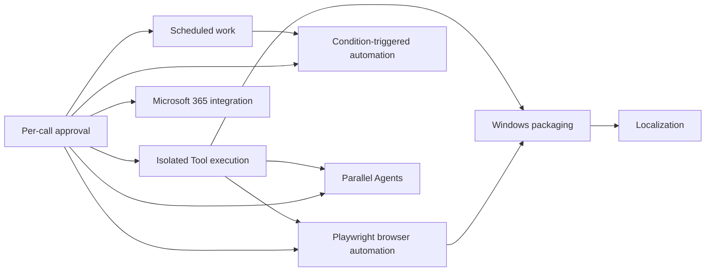

# DeskPilot Prompt File order

This folder contains implementation Prompt Files for candidate DeskPilot
features. Invoke one Prompt File at a time. Complete its tests, review, and
integration before invoking a Prompt File that depends on it.

The sequence is a recommendation, not a roadmap commitment. Reassess the
remaining order after each feature because implementation findings can change a
later feature's prerequisites or value.

## Recommended order

1. [Implement per-call approval](implement-per-call-approval.prompt.md)
   establishes the action-level safety control required by higher-agency
   features.
2. [Implement diagnostics and support bundle](implement-diagnostics-support-bundle.prompt.md)
   adds evidence for diagnosing the more complex runtime features that follow.
3. [Implement scheduled work](implement-scheduled-work.prompt.md) defines the
   single-active-Turn dispatcher, collision policy, recovery, and unattended
   Permission boundary.
4. [Implement isolated Tool execution](implement-isolated-tool-execution.prompt.md)
   contains Terminal actions and requires per-call approval.
5. [Implement Microsoft 365 work integration](implement-microsoft-365-integration.prompt.md)
   begins with one read-only, delegated, least-privilege workflow. Keep send,
   share, and mutation operations out of the first slice.
6. [Implement Playwright browser automation](implement-browser-automation.prompt.md)
   follows approval and isolation. Name one workflow, target environment,
   permitted domains, private-data inputs, and outbound actions before starting.
7. [Implement condition-triggered automation](implement-event-triggered-automation.prompt.md)
   reuses the scheduled-work dispatcher and begins with one confined local
   Project file event.
8. [Implement parallel Agents](implement-parallel-agents.prompt.md) comes after
   approval and isolation because it multiplies concurrency, Permission, Usage,
   cancellation, and file-integration concerns.
9. [Implement Windows packaging](implement-windows-packaging.prompt.md) packages
   the settled runtime and its Playwright or isolation dependencies, avoiding an
   installer redesign after each runtime feature.
10. [Implement localization](implement-localization.prompt.md) follows the major
    UI and safety-copy changes so translated resources do not churn repeatedly.

## Dependency gates

A Prompt File with an unmet gate may still be invoked for design discovery, but
its own prerequisite section requires implementation to stop before production
code is shipped.

## Optional timing changes

Move Windows packaging directly after diagnostics when installation is the
current adoption blocker. Expect to extend the package later for Playwright or
isolated execution.

Move localization earlier only when a near-term release must support another
language. Otherwise, leaving it last avoids retranslating controls and safety
copy introduced by the other features.

The read-only Microsoft 365 slice may move after diagnostics when it has higher
product value than scheduling. Do not include outbound mutations until per-call
approval exists and the identity and data-flow contract has been approved.

## Intercom remediation Prompt File

[Fix the Intercom group-chat security findings](fix-intercom-group-findings.prompt.md)
is a historical remediation Prompt File, not part of the feature sequence. The
repository records those seven findings as closed. Invoke it only against a
Branch or revision where the assessment findings remain open; do not rerun it on
a revision that already contains the fixes.

## Selection source

See the [competitive landscape](../../specs/100-competitive-landscape.md) for
feature rationale, DeskPilot's current baseline, market evidence, and the
selection guidance behind this order.
