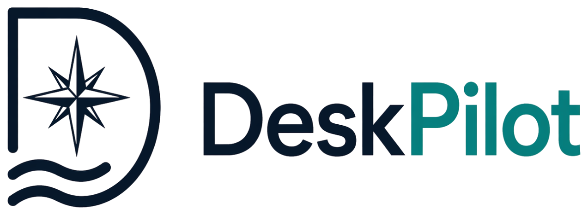

<!-- markdownlint-disable MD033 MD041 -->
<!-- Logo floated left; two transparent variants switch by theme via <picture>.
     Judge on github.com — editor previews mis-resolve prefers-color-scheme. -->
<picture>
  <source media="(prefers-color-scheme: dark)"
          srcset="assets/dp-logo-on-dark.png">
  
</picture>
<!-- markdownlint-enable MD033 -->

**A calm, modern desktop chat window that gives a non-technical user the full
GitHub Copilot agent** — able to browse, read and write files, run commands,
and follow Skills and Instructions — without a terminal or an IDE.

---

DeskPilot is the friendly front door to the
[Agentic Operating Model](https://github.com/raandree/AgenticOperatingModel):
it fronts the [ShellPilot](https://github.com/raandree/ShellPilot) engine (which
talks to GitHub Copilot) with a local web UI, so the people the model is meant to
serve — analysts, operators, lawyers, researchers — can do agentic knowledge
work without driving the tool stack themselves.

<!-- markdownlint-disable MD033 -->
<br clear="left">
<!-- markdownlint-enable MD033 -->

[](https://www.powershellgallery.com/packages/DeskPilot)
[](https://www.powershellgallery.com/packages/DeskPilot)
[](https://github.com/raandree/DeskPilot/actions/workflows/ci.yml)

> **Status: experimental pre-release.** DeskPilot builds on ShellPilot, which
> talks to internal Copilot endpoints intended for first-party editors. They may
> change without notice. See [Security](#security).

## What it gives you

- **A real agent, not autocomplete.** Every message drives a Copilot agent with
  the same tools VS Code Copilot has.
- **Visible permissions.** Five tool categories — Browsing, Files, Terminal,
  Ask-you, Your tools — each a switch you control, with plain-language risk
  notes. Terminal is **off** by default.
- **Show the work.** Each answer carries an Activity panel: what was read,
  written, run, fetched, or asked.
- **Review every change.** When the agent edits files in a Git project, the
  answer carries a **Changes** card — `N files changed  +A  −D`, one row per
  file. Click a file for a real diff with line numbers; then **Keep** it (accept
  it as reviewed) or **Undo** it (back to how it was before the agent touched
  it).
- **Save everything in one step.** **Save all…** records every changed file in
  the project's history as one entry, with a description DeskPilot suggests and
  you can edit — or press ✨ and let the model read your changes and write it.
  No staging, no `git add`, no terminal — and nothing leaves your computer until
  you send it.
- **Git without the vocabulary.** A **Branch Wizard** covers everything a
  non-expert needs: create, switch, delete, merge, and *get from* / *send to*
  the server. When two people changed the same lines, DeskPilot writes the
  prompt that asks the agent to sort it out — you read it, then send it.
- **Honest cost.** Token usage, estimated USD cost, and Copilot credits after
  every turn.
- **Your house rules.** Point it at folders of Skills and Instructions — the
  same files VS Code Copilot uses — and the agent discovers them.
- **Calm, build-free UI.** A static single-page app served locally. No npm, no
  bundler, nothing for you to install beyond PowerShell 7.

## Requirements

- **PowerShell 7.0+** (Windows, macOS, or Linux).
- A **GitHub account with Copilot access**.
- A network connection on first run. DeskPilot downloads the **ShellPilot**
  engine from the PowerShell Gallery into your user scope (`-Scope CurrentUser`,
  preview versions allowed) the first time it can't already find it, then imports
  it by name. You can also point at an explicit build with `-EngineModulePath`.
- A modern browser.

## Quick start

### From the PowerShell Gallery (recommended)

```powershell
Install-Module DeskPilot -Scope CurrentUser
Start-DeskPilot
```

`Start-DeskPilot` starts the local Host Server, prints a URL such as
`http://127.0.0.1:8473/?t=<token>`, and opens your browser. The web UI is
bundled in the module, so there is nothing else to download. On first run it
walks you through GitHub sign-in (device code) from inside the window, and
installs the ShellPilot engine from the Gallery if it is not already present.
Use `-NoBrowser` to keep the browser from opening automatically.

### From a source checkout (for development)

```powershell
# From the repository root
./Start-DeskPilot.ps1
```

Or on Windows, double-click `DeskPilot.cmd`. This launcher builds the module on
first run (resolving build dependencies from the Gallery, which can take a
minute), imports it, and serves the UI from `source/web` so edits hot-reload on
a browser refresh.

### Pointing at a specific engine build

Pass an explicit module path to use a local build and skip the Gallery download:

```powershell
./Start-DeskPilot.ps1 -EngineModulePath 'V:/Git/ShellPilot/output/module/ShellPilot/0.0.1/ShellPilot.psd1'
```

### Options

| Parameter | Meaning |
| --- | --- |
| `-Port <int>` | Port to listen on. `0` (default) picks a free one. |
| `-EngineModulePath <path>` | Explicit path to the ShellPilot module (skips the Gallery download). |
| `-NoBrowser` | Do not open the browser automatically. |

## How it works

```text
Browser (static SPA)  ──REST/SSE──▶  Host Server (PowerShell)  ──Invoke-Shp──▶  Engine (ShellPilot)  ──▶  GitHub Copilot
```

- The **Host Server** is a small PowerShell HTTP + Server-Sent-Events bridge. It
  owns conversations, settings, and streaming, and runs every turn on a single
  long-lived **Engine runspace**.
- The **Engine** (ShellPilot) does all the Copilot work: tools, skills, models,
  usage, and auth. DeskPilot re-implements none of it.
- Answers **stream** token-by-token to the browser; the final text, the Activity,
  and the Usage are sent when the turn completes.

See the [specs](specs/000-overview.md) for the full design, and the
[memory bank](.memory-bank/projectbrief.md) for project context.

## Project layout

```text
DeskPilot/
  .memory-bank/        Project knowledge base (brief, context, patterns, glossary)
  specs/               Product + technical specifications
  source/              Host Server PowerShell module (Public/Private/manifest/web; built by Sampler)
  source/web/          Static single-page UI (no build step), bundled into the module
  tests/               Pester 5 tests: tests/QA (module quality) + tests/Unit
  output/              Build output, gitignored (built module + test results)
  build.ps1            Sampler build bootstrap
  build.yaml           Sampler build configuration
  RequiredModules.psd1 Build + runtime module dependencies
  GitVersion.yml       Versioning configuration
  Start-DeskPilot.ps1  Launcher (builds on first run, then imports the built module)
  DeskPilot.cmd        Double-click launcher (Windows)
```

## Security

DeskPilot hands you an agent that acts with **your** privileges. That power is
the point and the risk. DeskPilot keeps it visible and governable; it does not
sandbox the agent.

- **Localhost only.** The Host Server binds to `127.0.0.1` and requires a random
  per-launch session token on every API call, so other local processes cannot
  drive your agent.
- **Permissions are explicit.** A tool that is switched off is never offered to
  the model. Terminal and Files are flagged as powerful; Terminal defaults off.
- **Workspace folder is a default, not a jail.** It sets where file and terminal
  tools work by default; the agent can still use absolute paths. Point it at a
  dedicated, version-controlled folder so changes are diffable and revertible.
- **Inherited engine caveats.** ShellPilot caches its OAuth token in clear text
  and calls internal Copilot endpoints. Use a single-user machine.

See [specs/050-security-model.md](specs/050-security-model.md) for the full
threat model.

## Building and testing

DeskPilot uses the [Sampler](https://github.com/gaelcolas/Sampler) build
framework (ModuleBuilder, InvokeBuild, Pester 5, PSScriptAnalyzer, GitVersion).

```powershell
# Resolve build dependencies and build the module (first time)
./build.ps1 -ResolveDependency -Tasks build

# Run the test suite (QA + unit tests)
./build.ps1 -Tasks test

# Build and test in one go
./build.ps1
```

The built module lands in `output/module/DeskPilot/<version>/`, with the version
stamped from git by GitVersion. `Start-DeskPilot.ps1` builds automatically on
first run.

## Roadmap

Live Activity, structured-output surfaces, a user-tool manager, and a WebView2
single-window shell. See [specs/060-roadmap.md](specs/060-roadmap.md).

## License

MIT.

## See also

- [ShellPilot](https://github.com/raandree/ShellPilot) — the engine.
- [Agentic Operating Model](https://github.com/raandree/AgenticOperatingModel) —
  the operating model DeskPilot makes approachable.
- [CopilotAtelier](https://github.com/raandree/CopilotAtelier) — the canonical
  personal **Atelier** referenced by the Agentic Operating Model (Module 3:
  *Your Atelier — Customization as Code*; Module 8: *A Mature Personal
  Atelier*). It curates `~/.copilot/{agents,instructions,skills,prompts}`
  across machines via OneDrive + NTFS junctions, which is exactly the layout
  DeskPilot already discovers (so a CopilotAtelier-managed Atelier appears in
  DeskPilot's Agents picker and Skill/Instruction roots out of the box).
