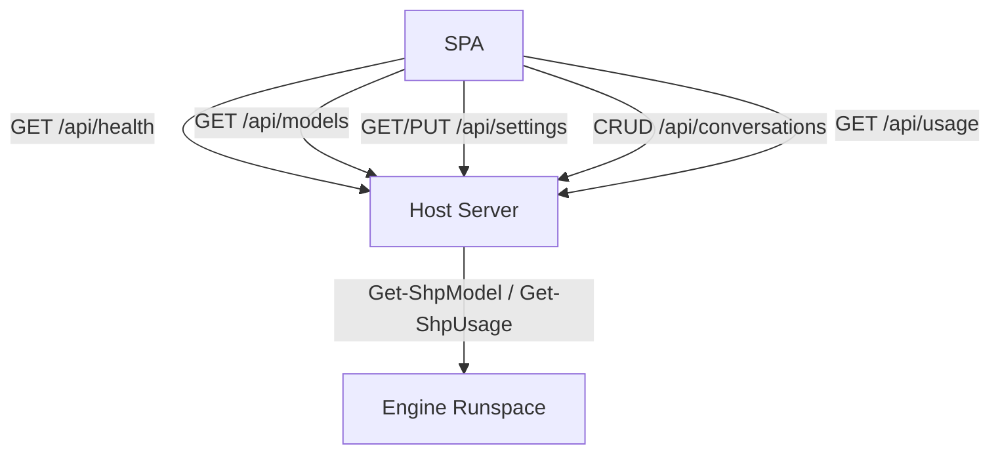

# 020 — Architecture

## Components

| Component | Tech | Responsibility |
| --- | --- | --- |
| **SPA** | static HTML/CSS/JS | Render Conversations, stream Messages, capture input, show Activity/Usage/Permissions. |
| **Host Server** | PowerShell 7 + `HttpListener` | Route REST, stream SSE, own Conversation store and Settings, orchestrate the Engine. |
| **Engine Runspace** | one long-lived runspace | Hosts the imported Engine; runs `Invoke-Shp` per Turn. |
| **Engine** | ShellPilot module | Copilot transport: Tools, Skills, Models, Usage, auth. |

## Process & runspace model

- The Host Server runs in the launching PowerShell process and owns the
  `HttpListener` accept loop.
- At startup it creates **one Engine Runspace**, imports the Engine into it, and
  checks auth. Module-scoped state (token, selected Model) lives here for the
  Host Server's lifetime.
- Each Turn creates a fresh `[PowerShell]` instance **bound to the Engine
  Runspace**, adds `Invoke-Shp` with the assembled parameters, subscribes to its
  `Streams.Information.DataAdded`, and `BeginInvoke`s it. Per-Turn Streams are
  isolated even though the runspace is shared; only one Turn runs at a time.

## Streaming design

Engine streaming is on by default: answer tokens are echoed via `Write-Host`,
which lands as `InformationRecord`s on the `[PowerShell]` instance's
`Streams.Information`. The Host Server:

1. Subscribes to `Streams.Information.DataAdded`.
2. In the handler, reads new records, extracts `MessageData.Message`, strips any
   ANSI, and enqueues the delta on a `System.Collections.Concurrent.ConcurrentQueue`.
3. Runs an SSE loop on the request thread: drain the queue → write
   `event: delta` frames; emit periodic heartbeats; stop when `BeginInvoke`
   completes.
4. Calls `EndInvoke` to obtain the result object, appends `.History` to the
   Conversation, and writes a final `event: done` with the authoritative
   `.Content`, the Activity, and the Usage.

The **final Message text is `.Content`** (clean), not the concatenated deltas
(which exist only for the live typing effect). `-ShowThinking` is **off** for the
answer stream so deltas stay clean; reasoning, when requested, is shown from the
result's `.Reasoning` in a collapsible block.

## Data flow (REST)



## Conversation store

- An in-memory ordered map keyed by Conversation id, **backed by disk**.
- Each Conversation: `{ id, title, createdUtc, updatedUtc, messages[], history[], model? }`.
- `messages[]` is what the UI renders; `history[]` is the Engine `-History`
  payload (`{role, content}`). They are kept in step but serve different
  consumers.
- **Persistence.** The whole store is written to `conversations.json` in the
  data directory after every mutation (create, rename, model change, delete, and
  after each completed Turn). On startup the store is loaded from that file, so
  Conversations survive a Host Server restart (FR-C7). Deleting a Conversation
  removes it from the file as well as memory (FR-C8). Writes are atomic
  (temp-file + move) and best-effort: a disk failure is logged but never aborts a
  Turn. Single-user, so no locking is needed.

## Usage counters

Two independent counters, both fed by `Update-DpUsage` after each Turn:

- **Session Usage** (`$state.Usage`) — tokens, cost, credits, turns, and a
  per-Model breakdown. Initialised to zero at startup, so it always reflects the
  current run (FR-U2).
- **Lifetime Usage** (`$state.LifetimeUsage`) — the same totals plus a `sinceUtc`
  stamp, **persisted** to `lifetime-usage.json` in the data directory. Loaded on
  startup and accumulated across every session; never reset automatically
  (FR-U3). The user can reset it manually, which zeroes the totals and sets a new
  `sinceUtc` (FR-U4).

## Settings persistence

Settings (Model, Permissions, Projects and the selected Project, Skill/Instruction
roots, reasoning effort, show-thinking, tool-iteration cap) persist to
`settings.json` in the data directory. Loaded on startup and rewritten on every
successful `PUT /api/settings`, so the user's choices survive across sessions
(FR-S1). Like the other persisted state, the write is atomic and best-effort: a
disk failure is reported but never aborts the request, and a corrupt file falls
back to defaults.

## Projects

A **Project** is a registered, named Workspace Folder: `{ id, name, path }`.
Settings hold the `projects` registry and the `selectedProjectId`. The selected
Project's `path` is mirrored into the derived `workspaceFolder` field on every
merge, so the Turn and Upload code keep reading a single `workspaceFolder` value
unchanged. `Merge-DpSettings` generates an id and defaults a missing name to the
path's leaf, validates that a selection refers to a known Project (else HTTP
400), clears a stale selection when its Project is removed, and migrates a legacy
direct `workspaceFolder` write into a registered, selected Project. The selected
Project persists, so it is the default working folder for the next prompt
(FR-M2, FR-M2a).

## Customizations

A **Customization** is an agent-shaping Markdown file the user can browse and
edit: an **Agent** (`*.agent.md`), a **Skill** (a `SKILL.md` in a sub-folder),
an **Instruction** (`*.instructions.md`), or a **Prompt File** (`*.prompt.md`).
Each category maps to the root Setting that already configures it (`agentsRoot`,
`skillRoots`, `instructionRoots`, `promptRoots`). `Get-DpCustomizationCatalog` is
the single source of truth for the four categories: display label, root Setting,
single-vs-array, the on-disk file pattern, and the starter scaffold a new file
gets.

`Get-DpCustomizationList` enumerates every category from its roots (a skill is
named after the folder that holds its `SKILL.md`; the others after the file stem
or the frontmatter `name`), tags each item with a scope (`User` for files under
`~/.copilot`, otherwise `Workspace`), and returns a per-category count.

Reads and writes pass through **one security gate**,
`Resolve-DpCustomizationPath`: it confirms the path is a descendant of a
configured root (a case-insensitive prefix test on a directory-separator
boundary, so a `..` escape or a shared-prefix sibling is refused) **and** that
the file name matches the category pattern. `Get-DpCustomizationContent` reads
the UTF-8 text (1 MiB cap, BOM strip, NUL-byte binary sniff; an over-cap file
opens read-only). `Save-DpCustomizationContent` requires the file to already
exist and writes atomically (temp file + `Move-Item -Force`, UTF-8 no BOM).
`New-DpCustomization` validates the name as a single safe path segment, creates
`<root>/<name><suffix>` (or `<root>/<name>/SKILL.md` for a skill) from the
scaffold, and refuses an existing target. No Engine call is involved; editing an
Agent simply changes the file its persona is read from.

## File uploads

Uploads land in the Workspace Folder (FR-C9). `POST /api/uploads` accepts
`multipart/form-data`; the Host Server writes each part to a unique filename in
the Workspace Folder (collision-safe via `name (n).ext`) and returns the saved
relative path. The browser sends the upload before the prompt; the prompt then
includes a brief "attached files" note that names the relative paths so the
agent's existing File Tool reads them on its first iteration. No new model API
or Tool is added.

## Data directory

Persistent state lives outside the repo in a per-user data directory, resolved
in order: `$LOCALAPPDATA/DeskPilot` (Windows), `$XDG_DATA_HOME/DeskPilot`, then
`~/.local/share/DeskPilot`. It holds `conversations.json`,
`lifetime-usage.json`, and `settings.json`. The directory is created on first
launch and can be overridden with `Start-DeskPilot -DataDir`.

## Settings object

```jsonc
{
  "model": "claude-opus-4.8",
  "permissions": {
    "browsing": true, "file": true, "terminal": true,
    "askUser": true, "userTools": true
  },
  "projects": [
    { "id": "p_a1b2c3d4e5", "name": "DeskPilot", "path": "C:/Users/me/Documents/DeskPilot" }
  ],
  "selectedProjectId": "p_a1b2c3d4e5",
  "workspaceFolder": "C:/Users/me/Documents/DeskPilot",
  "agentsRoot": "C:/Users/me/.copilot/agents",
  "selectedAgent": "tax-researcher.agent.md",
  "skillRoots": [], "instructionRoots": [], "promptRoots": [],
  "reasoningEffort": null,
  "showThinking": false,
  "maxToolIterations": 25,
  "taskTracking": true
}
```

`workspaceFolder` is **derived** — it always mirrors the selected Project's path
and is not set directly by clients (a direct write is migrated to a Project).
`agentsRoot`, `skillRoots`, `instructionRoots` and `promptRoots` default from
`~/.copilot` (`agents`, `skills`, `instructions`, `prompts`) when those folders
exist.

Settings are read at the **start of each Turn**, so changes take effect on the
next prompt. Permissions map to Engine switches:

| Permission | Off → Engine switch |
| --- | --- |
| browsing | `-DisableBrowsing` |
| file | `-DisableFileAccess` |
| terminal | `-DisableTerminal` |
| askUser | `-DisableUserPrompts` |
| userTools | `-DisableUserTools` |

The `taskTracking` Setting is **not** a Permission. When on (default), the
Host Server passes `-EnableTodoList` to `Invoke-Shp`; when off, the Task List
tool is not offered to the model and live `tasks` events are ignored.

## Turn parameter assembly

Given a Conversation and Settings, the Host Server builds an `Invoke-Shp`
parameter splat:

- `-Prompt` = user text; `-History` = Conversation history.
- `-Model` = Conversation model → Settings model.
- one `-Disable*` switch per Permission that is **off**.
- `-SkillPath` / `-InstructionRoot` if configured.
- `-ReasoningEffort`, `-MaxToolIterations` if set.
- `-SystemPrompt` composed from the selected **Agent**'s `*.agent.md` body (if
  any) followed by a note naming the selected **Project** folder as the working
  directory.
- `-EnableTodoList` when the `taskTracking` Setting is on, exposing the
  Engine's `manage_todo_list` tool to the model so it can plan the Turn as a
  Task List.
- working directory set on the Engine Runspace from the Workspace Folder.

## Technology rationale

- **PowerShell Host Server (not Electron/Node).** In-process Engine integration,
  no extra runtime, fits the PowerShell/Sampler/Pester ecosystem, testable with
  Pester.
- **SSE (not WebSockets).** One-directional token streaming; simpler, robust,
  native `EventSource` in the browser.
- **Static SPA (no build).** Nothing for a non-technical user to install.
- **Single-threaded accept loop.** Sufficient for one local user; only the
  Engine call is off-thread so SSE can stream while it runs.

## In-Turn Task List

The agent maintains an ordered Task List **within a single Turn** so the user
can see the plan and its progress in real time. The single-Turn-at-a-time
constraint is unchanged — this is a checklist inside one Turn, not
multi-tasking across Turns.

Wiring is end-to-end on the Engine's first-class support, with no
marker-string parsing:

1. **Opt-in.** When `taskTracking` is on, the Host Server passes
   `-EnableTodoList` to `Invoke-Shp`. The Engine adds its built-in
   `manage_todo_list` tool to the request and a short system-prompt nudge.
2. **Live updates.** Every tool call and every Task List update emits a
   structured Information record on the Engine Runspace's
   `Streams.Information` with `Tags -contains 'ShpProgress'` and a
   `MessageData` payload of `{ Kind = 'ToolCall' | 'TodoList'; ... }`. A
   `TodoList` record carries the **full normalised list** (idempotent
   replace, not a delta).
3. **Stream classification.** `Get-DpStreamFrame` inspects every Information
   record before the existing trace/delta path. ShpProgress records are
   diverted: `TodoList` → `tasks` SSE frame after `ConvertTo-DpTaskList`
   re-normalises the payload at the DeskPilot boundary; `ToolCall` is
   absorbed silently (the live Activity is already populated from the result).
   Unknown ShpProgress `Kind`s are ignored for forward-compatibility. Records
   without the `ShpProgress` tag fall through to the existing trace/delta
   path unchanged.
4. **Final list.** `result.TodoList` is the authoritative final list.
   `ConvertFrom-DpEngineResult` re-normalises it through
   `ConvertTo-DpTaskList` and stores it as `tasks` on the assistant Message,
   alongside `activity`, `usage` and `reasoning`. The Conversation store
   persists it; the SPA replays it on history reload.

Marker-string parsing of `Write-Host` text is **explicitly forbidden** as a
fallback: `-ShowThinking` host trace is debug-only and must not feed UI state.
If ShpProgress events are absent, the Task List simply doesn't render live,
and the final list still arrives via `result.TodoList`.

Naming: ShellPilot's `manage_todo_list` tool name and `TodoList` result
property are third-party identifiers from the Engine boundary and are kept
verbatim. They are mapped to `Task` and `Task List` (and the matching
`tasks` JSON/SSE field, `Get-DpTaskList` etc.) immediately as they cross
into DeskPilot code, persistence, UI copy and docs (Ubiquitous Language).

## Failure handling

- Engine import or auth failure → `/api/health` reports it; UI shows a guided
  screen.
- Turn exception → `event: error` over SSE; Conversation history is left
  unchanged (the failed Turn is not appended).
- Browser disconnect mid-Turn → the Engine call still completes; result is
  stored so a reload shows the final Message.
