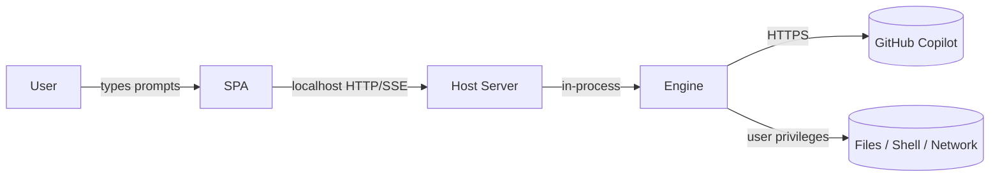

# 050 — Security Model

DeskPilot hands a non-technical user an agent that can read and write files,
run commands, and browse the web with **their full privileges**. That power is
the point — and the risk. This spec defines how DeskPilot keeps it visible and
governable. It does **not** claim to sandbox the agent.

## Trust boundaries

- **SPA ↔ Host Server:** localhost only. The browser is trusted as the user's
  own; the Host Server validates all input at this boundary.
- **Host Server ↔ Engine:** in-process; the Host Server assembles parameters and
  enforces Permissions by passing `-Disable*` switches.
- **Engine ↔ OS:** the real risk surface — File/Terminal Tools act as the user.
- **Engine ↔ Copilot:** the Engine's existing TLS channel; out of DeskPilot's
  scope.

## Threats & mitigations

| # | Threat | Mitigation |
| --- | --- | --- |
| T1 | A prompt (or prompt-injected web content) makes the agent delete/overwrite files or run destructive commands. | Permissions are explicit and default-reviewable; File/Terminal flagged as powerful in the UI; Workspace Folder scopes the default working directory; Activity shows exactly what happened; destructive-ops guidance (below). |
| T2 | The Host Server is reachable from the network. | Bind `127.0.0.1` only; refuse non-loopback binds unless an explicit `-Bind`+token opt-in is given; document loudly. |
| T3 | Another local process calls the API (CSRF/port-scan). | Require a per-launch **session token** (random, printed by the launcher and embedded in the served `index.html`) on every `/api/*` call; check `Origin`/`Host` headers; reject cross-origin. |
| T4 | The cached Copilot OAuth token is read by another user on a shared machine. | Inherited Engine behaviour (clear-text at the Engine's default token dot-file in the home directory, `~/.shellpilot-token`; historically `~/.copilot-demo-token`); DeskPilot documents it, derives the path from the Engine rather than hardcoding it, and recommends single-user machines; encrypted storage tracked upstream. |
| T5 | Prompt injection from fetched web pages or read files steers the agent. | Browsing/File are Permissions the user can turn off; Activity surfaces fetched URLs and read files; docs warn that agent output reflects untrusted content. |
| T6 | Secrets in agent output or logs. | The Host Server does not persist prompts/answers to disk in v1; no server-side logging of Message bodies beyond memory; Usage logging excludes content. |
| T7 | A runaway tool loop burns cost. | `MaxToolIterations` cap (Engine) exposed in Settings; per-Turn Usage shown; Stop control. |
| T8 | The filesystem endpoints (folder picker + explorer) read or create arbitrary paths. | Loopback + session-token gated like all `/api/*`. They enumerate and create **directories only**, never file contents. `mkdir` accepts a single path segment (separators and `..` rejected). The explorer tree (`/api/fs/tree`) is confined to the selected Project's folder; a path escaping it is refused. |
| T9 | The Git endpoints run `git` on the host. | Confined to the selected Project's folder; `git` is invoked via a process call with an argument list (no shell, so no argument injection). `init` only runs `git init`; `checkout` only switches to a branch validated against the live local-branch list. A failing checkout (e.g. uncommitted changes) is surfaced as `409`, not forced. |
| T10 | The Customizations endpoints read or **write** files outside the customization folders. | Loopback + session-token gated like all `/api/*`. Every read, write, and create passes one gate (`Resolve-DpCustomizationPath`): the path must be a descendant of a **configured root** (case-insensitive prefix on a separator boundary, so `..` escapes and shared-prefix siblings are refused) **and** match the category's file pattern (`*.agent.md`, `SKILL.md`, `*.instructions.md`, `*.prompt.md`). A save targets an **existing** file only; a create validates the name as a single safe path segment and refuses an existing target; writes are atomic (temp + `Move-Item -Force`). Reads cap at 1 MiB and skip binary files. |
| T11 | Persistent **Memory** injected into the system prompt carries injected instructions or leaked secrets into future Turns (a conversation may include untrusted content the agent fetched or read). | Both stores are **bounded** (`Get-DpMemoryLimits`) and **fenced** in the system prompt as *reference-not-instructions* (`New-DpTurnParameter`), so a recalled fact is not treated as a fresh command. The autonomous learning prompt (`New-DpMemoryPrompt`) instructs the Model to write **declarative facts only** and to exclude secrets, credentials, and transient task state; learning is best-effort and never touches the visible transcript. Memory is **user-visible, editable, and clearable** in Settings, and autonomous learning is one toggle to disable. Residual risk (same posture as the manual Preferences block, which is also injected): the memory text is not deep-scanned for injection — a hardening pass (pattern + invisible-Unicode scan on write) is a documented future improvement. |
| T12 | The opt-in **CopilotAtelier setup** downloads and executes a remote script with the user's privileges. | The source is a **fixed first-party URL** (`raandree/CopilotAtelier`, the same owner as DeskPilot) fetched over HTTPS — never a user-supplied URL, so there is no request-forgery/injection surface. It is strictly **opt-in and consent-gated**: the SPA shows a dialog spelling out exactly what the script changes (the `~/.copilot` junctions, VS Code `settings.json`/`keybindings.json`, and the `COPILOT_ALLOW_ALL` user env var) before anything is downloaded or run, so it is never one click. The script then runs in a **visible console the user drives**, so its own safety prompts work and DeskPilot never answers them on the user's behalf; on non-Windows the script is not run (only the files are fetched). Loopback + session-token gated like all `/api/*`. |
| T13 | The **self-update** installs modules from the PowerShell Gallery with the user's privileges, reloads the Engine, and can relaunch the host. | The module names are **fixed and first-party** (`DeskPilot`, `ShellPilot`) — never user-supplied — so there is no injection/typosquat surface, and installs go to the **CurrentUser** scope (no elevation). It is strictly **consent-gated**: the background check only *reports* availability; nothing installs until the user clicks **Update now**, and nothing relaunches until the user clicks **Restart DeskPilot**. Previews are installed only when the user opted in (`updateIncludePrereleases`). The Engine reload re-imports ShellPilot in the Engine Runspace only (which runs no DeskPilot code; the token stays on disk); the DeskPilot host is never re-imported in-process (that would repoint route handlers to an uninitialised module scope), so it is applied by a clean relaunch. The relaunch spawns the **current** PowerShell executable running a fixed command (`Import-Module DeskPilot -Force; Start-DeskPilot`) — no user input in the command line. Both `install` and `restart` refuse mid-Turn (`409 busy`) and are loopback + session-token gated like all `/api/*`; `409 already_installing` guards concurrent installs. |
| T14 | A crafted Message request supplies an arbitrary local path as a native Vision image, bypassing File Permission. | `POST /api/uploads` records each successfully written file's normalized path and MIME type in a per-launch Attachment registry. `images` accepts only absolute, existing paths in that registry whose recorded type starts with `image/`; `Resolve-DpAttachmentPath` rejects unregistered, relative, missing, and non-image inputs before `Invoke-Shp -Image` receives them (`400 invalid_attachment`). Because eligibility is tied to the upload event rather than the currently selected Project, a legitimate pending Attachment survives a Project switch without widening access to other local files. The endpoint remains loopback, origin, and session-token gated. |

## Permissions model

Five Tool categories map 1:1 to Engine switches. A Permission **off** passes the
matching `-Disable*` switch, so the Engine never even offers the Tool to the
model:

| Permission | Engine switch when off | Risk note shown in UI |
| --- | --- | --- |
| Browsing | `-DisableBrowsing` | "Can read web pages you don't control." |
| File | `-DisableFileAccess` | "Can read and **write** files as you." |
| Terminal | `-DisableTerminal` | "Can **run commands** as you." |
| Ask-User | `-DisableUserPrompts` | "Can pause to ask you a question." |
| User Tools | `-DisableUserTools` | "Can call tools you've registered." |

Defaults (v1): Browsing **on**, File **on**, Terminal **off**, Ask-User **on**,
User Tools **on**. Terminal defaults off because it is the highest-blast-radius
Tool for a non-technical user; turning it on is a deliberate act.

## Workspace Folder

- Sets the Engine Runspace working directory so relative File/Terminal
  operations land in a chosen folder.
- With no Project selected the working directory is a neutral scratch folder in
  the per-user data directory (not the folder DeskPilot was launched from and
  not a previously selected Project), so a no-Project Turn cannot silently read
  files — for example a `.memory-bank` — that belong to an unrelated context.
- It is a **default and a convenience, not a jail**: the agent can still use
  absolute paths. The UI states this plainly.
- v1 recommends pointing it at a dedicated working folder, not a home or system
  directory.

## Destructive-operations guidance

Mirroring the AgenticOperatingModel's guardrail theme:

- The UI flags File and Terminal as powerful and defaults Terminal off.
- Activity makes every write/command visible after the Turn.
- Docs recommend: work in a dedicated Workspace Folder, keep it under version
  control (so changes are diffable and revertible), and review Activity before
  trusting results.
- v2 candidate: a confirm-before-run gate for Terminal commands and file writes
  outside the Workspace Folder.

## Localhost & session token

- Default bind: `http://127.0.0.1:<random-or-configured-port>`.
- The launcher generates a random session token, prints the full URL
  (`http://127.0.0.1:port/?t=token`), and the Host Server requires the token on
  `/api/*`. This stops other local processes from driving the agent.
- Binding to a non-loopback address requires an explicit flag and is documented
  as advanced/at-your-own-risk.

## Out of scope (v1)

- True OS-level sandboxing of agent Tools.
- Encrypting the Engine's cached token (upstream concern).
- Multi-user authn/authz.
